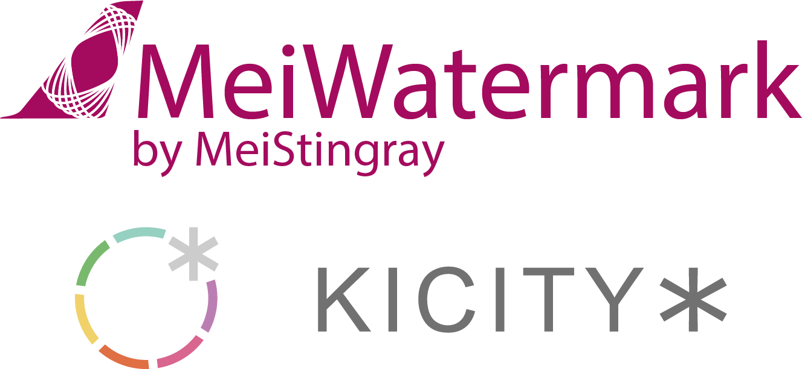

# MeiWatermark

<p align="center">
  
</p>

<p align="center">
  <strong>简体中文</strong> · <a href="README.en.md">English</a> · <a href="README.es.md">Español</a> · <a href="README.ja.md">日本語</a>
</p>

MeiWatermark 是一款开源桌面批处理水印工具，支持多图层水印，与跨尺寸图片的一致视觉比例和定位。

可叠加、排序图片和文字水印，提供九宫格定位、内嵌边距、透明度、旋转及文字描边等控制，并支持保存为预设。

支持 JPEG、PNG、WebP 批量导出，提供质量、尺寸约束、文件大小估算和相对路径输出。

## 特性

- **多图层水印**：同时叠加多个图片或文字水印；可启用、排序并拖动调整图层顺序。
- **一致的视觉效果**：水印尺寸可按原图短边的百分比或像素设置；文字水印的尺寸指最终文字整体的最长边，图片与文字水印使用一致的尺寸语义。
- **精细定位**：九宫格锚点、水平/垂直内嵌、透明度和旋转均可独立控制；内嵌值支持负数。
- **文字水印**：使用系统字体列表，支持本地化字体名称、独立设置文字与边框颜色、无颜色以及边框宽度。
- **全屏水印**：可创建图片或文字的全屏重复水印；间距按图片短边百分比计算，并支持错列排列。
- **实时预览**：拖入照片后即时查看水印效果；本次新增的照片会自动选中并滚动到列表可见位置。
- **照片列表管理**：支持 Delete 键、右键菜单移除照片，以及清空列表；这些操作不会删除磁盘中的原始文件。
- **批量导出**：支持 JPEG、PNG、WebP；质量滑杆默认为 100，并可按最长边、最短边或比例限制尺寸，也可以不限制尺寸。
- **输出控制**：导出前估算单张及批次文件大小；可保留 EXIF 和 ICC 配置文件；支持相对于每张原图的输出路径。
- **预设管理**：一个预设同时保存水印图层和导出设置。每个预设独立保存为 JSON 文件，便于备份、共享或手动清理。
- **本地处理**：图像在本机完成读取、预览与导出，不依赖云端服务。
- **多语言界面**：内置简体中文、English、Español 与日本語。

## 使用方法

1. 点击“打开图片”，或将一张/多张图片直接拖入整个窗口。
2. 点击“+图片水印”“+文字水印”或“+全屏水印”，在左侧图层列表中调整顺序和启用状态。
3. 选中图层后，在“选中图层属性”中设置大小、内嵌、透明度、旋转和九宫格定位。
4. 在右侧选择输出格式、质量、尺寸约束和导出路径。
5. 点击“导出”批量生成结果。

## 水印比例与定位

“视觉比例”以内嵌方向的短边为基准，使横图和竖图在全屏观看时保持接近的视觉边距；内嵌的“百分比”按对应方向的宽或高计算；“px”用于需要固定像素值的场景。

水印尺寸的“%”按原图短边计算。对于文字水印，比例对应渲染后文字整体的最长边，而不是字体字号，因此较长文字不会因为字符数量增加而超出预期比例。

建议将水印大小设为“%”、内嵌设为“视觉比例”，再通过九宫格确定锚点并微调内嵌值，以获得跨图片尺寸和构图的一致效果。

全屏水印使用相同的大小、透明度和旋转控制，但会重复铺满整张照片。它的间距固定按图片短边的百分比计算；全屏层不使用内嵌或九宫格定位。

## 预设与导出路径

预设会同时保存图层及导出设置，默认目录为：

```text
%LOCALAPPDATA%\MeiWatermark\
```

每个预设对应一个 `.json` 文件。界面的“管理”按钮会打开该目录；保存同名预设时，程序会提示是否覆盖。

导出路径留空时，导出前会选择目标目录。填写相对路径（例如 `/Mei`）时，程序会针对每张原图，在原图所在目录下创建对应的输出目录。

## 运行环境

- Windows 10 或更高版本
- Python 3.12（仅从源码运行时需要）

发布版为独立 Windows 可执行文件，无需单独安装 Python。

## 从源码运行

```powershell
conda create -n meiwatermark python=3.12 -y
conda activate meiwatermark
python -m pip install -e .
python -m meiwatermark
```

## 开发与打包

```powershell
# 运行测试
python -m unittest discover -s tests -v

# 构建 Windows 可执行文件
python -m PyInstaller --noconfirm MeiWatermark.spec
```

界面用语对照维护在 [docs/language-reference.md](docs/language-reference.md)。修改界面文字时，应同步更新该文档及所有内置语言。

## 许可证

本项目采用 [GNU General Public License v3.0 or later](LICENSE)（GPL-3.0-or-later）许可。

Copyright © 2026 MeiStingray, Kicity Studio
<https://www.kicity.com>
